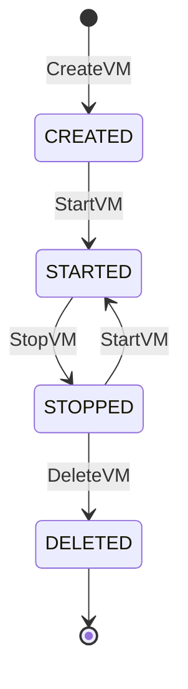

# Fulcrum Test Agent

A VM lifecycle management test agent for the Fulcrum Core platform

## Overview

The Fulcrum Test Agent simulates a real Fulcrum agent that manages virtual machine (VM) lifecycles and produces metrics related to these operations. It is designed to help with testing, development, and demonstration of the Fulcrum Core platform without requiring actual cloud providers.

This agent implements the complete Fulcrum agent protocol, including:
- Agent registration and authentication
- VM lifecycle management (create, start, stop, delete)
- Job queue processing
- Metrics generation and reporting
- Realistic operation timing and occasional simulated failures

## Installation

### Prerequisites

- Go 1.20 or higher
- Access to a running Fulcrum Core API
- Agent type and provider registered in Fulcrum Core

### Building

```bash
# Build the agent
go build -o fulcrum-test-agent
```

## Configuration

The test agent can be configured using a combination of a configuration file and environment variables.

### Configuration File

Create a JSON configuration file (e.g., `config.json`):

```json
{
  "agentToken": "YOUR_AGENT_TOKEN",
  "fulcrumApiUrl": "http://localhost:3000",
  "vmUpdateInterval": "5s",
  "jobPollInterval": "5s",
  "metricReportInterval": "30s",
  "operationDelayMin": "2s",
  "operationDelayMax": "10s",
  "errorRate": 0.05
}
```

### Default Configuration Values

The agent uses the following default values if not specified:

| Parameter              | Default Value           | Description                                |
| ---------------------- | ----------------------- | ------------------------------------------ |
| `agentToken`           | (empty)                 | Must be provided                           |
| `fulcrumApiUrl`        | "http://localhost:3000" | URL of the Fulcrum Core API                |
| `vmUpdateInterval`     | 5s                      | How often to perform VM resource updates   |
| `jobPollInterval`      | 5s                      | How often to poll for jobs                 |
| `metricReportInterval` | 30s                     | How often to report metrics                |
| `operationDelayMin`    | 2s                      | Minimum operation time                     |
| `operationDelayMax`    | 10s                     | Maximum operation time                     |
| `errorRate`            | 0.05                    | Probability of operation failure (0.0-1.0) |

### Environment Variables

Configuration can also be provided or overridden using environment variables. The agent automatically prepends `TESTAGENT_` to the field names defined in the Config struct:

- `TESTAGENT_AGENT_TOKEN`: Secret token of the agent
- `TESTAGENT_FULCRUM_API_URL`: URL of the Fulcrum Core API
- `TESTAGENT_VM_OPERATION_INTERVAL`: How often to perform VM operations
- `TESTAGENT_JOB_POLL_INTERVAL`: How often to poll for jobs
- `TESTAGENT_METRIC_REPORT_INTERVAL`: How often to report metrics
- `TESTAGENT_OPERATION_DELAY_MIN`: Minimum operation time
- `TESTAGENT_OPERATION_DELAY_MAX`: Maximum operation time
- `TESTAGENT_ERROR_RATE`: Probability of operation failure (0.0-1.0)

## Virtual Machine Lifecycle

The agent simulates VM lifecycle management with the following state machine:



### VM States

| State   | Description                        | Available Operations        |
| ------- | ---------------------------------- | --------------------------- |
| CREATED | Initial state after VM creation    | StartVM                     |
| STARTED | VM is running, consuming resources | StopVM                      |
| STOPPED | VM exists but is not running       | StartVM, DeleteVM, UpdateVM |
| DELETED | VM is marked for deletion          | (None)                      |

Each state transition includes a simulated delay and a configurable chance of failure to mimic real-world conditions.

## Usage

### Running the Agent

```bash
# Run with default configuration (requires TESTAGENT_AGENT_TOKEN to be set)
./fulcrum-test-agent

# Run with a configuration file
./fulcrum-test-agent -config config.json
```

### Stopping the Agent

The agent handles SIGINT and SIGTERM signals for graceful shutdown. Simply press `Ctrl+C` to stop it cleanly.

## Metrics Generated

The test agent generates the following metrics:

### Resource Utilization Metrics

- `vm.cpu.usage`: Simulated CPU usage percentage (0-100%)
- `vm.memory.usage`: Simulated memory usage percentage (0-100%)

All metrics are generated with realistic fluctuations to simulate actual VM behavior. The agent will automatically create and update VMs, then report metrics for these VMs at the configured interval.

## Job Processing

The test agent can process the following job types from Fulcrum Core:

- `ServiceCreate`: Creates a new VM in the CREATED state
- `ServiceUpdate`: Updates a VM (start/stop operations)
- `ServiceStart`: Transitions a VM from CREATED or STOPPED to STARTED
- `ServiceStop`: Transitions a VM from STARTED to STOPPED
- `ServiceDelete`: Deletes a VM (transitions from STOPPED to DELETED)

Jobs are processed according to the state machine rules. If a job requests an invalid state transition, the agent will report an error.

## Simulation Parameters

The test agent allows controlling the simulation behavior with these parameters:

- `operationDelayMin` and `operationDelayMax`: Control how long VM operations take
- `errorRate`: Controls how often operations fail (0.0 = never, 1.0 = always)
- `vmUpdateInterval`: Controls how often VM resource metrics are updated

These parameters help in testing how the Fulcrum Core platform handles various operation durations and error conditions.

## Development

### Hot Reloading

The project includes a configuration file for Air (`.air.toml`), which provides hot reloading during development:

```bash
# Install Air
go install github.com/cosmtrek/air@latest

# Run with Air for development
air
```

This will automatically rebuild and restart the agent when source files change.

## Troubleshooting

### Agent Won't Register

Make sure:
- Fulcrum Core API is running and accessible
- The provided agent token exists in Fulcrum Core
- Check connection errors in the agent logs

### No Metrics Appearing

Check:
- The metric type names are registered in Fulcrum Core
- The agent is successfully registered
- Verify the metrics reporting interval


### Unexpected VM States

If VMs seem to be in unexpected states:
1. Check the agent logs for operation errors
2. Review the state transition rules in the VM lifecycle section
3. Verify that job requests are requesting valid state transitions

## Development and Testing

The test agent includes comprehensive unit tests:

```bash
# Run all tests
go test ./...

# Run specific tests
go test -v ./agent
```

### Viewing Agent Status

The agent logs VM state counts and job statistics every 30 seconds:

```
VM States: map[CREATED:2 STARTED:5 STOPPED:3]
Jobs: Processed: 15, Succeeded: 14, Failed: 1
```

These logs provide visibility into the agent's internal state and operation history.