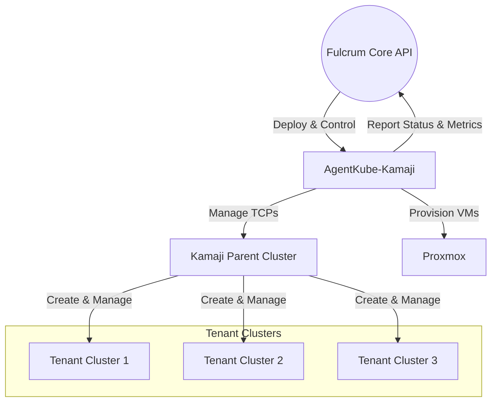
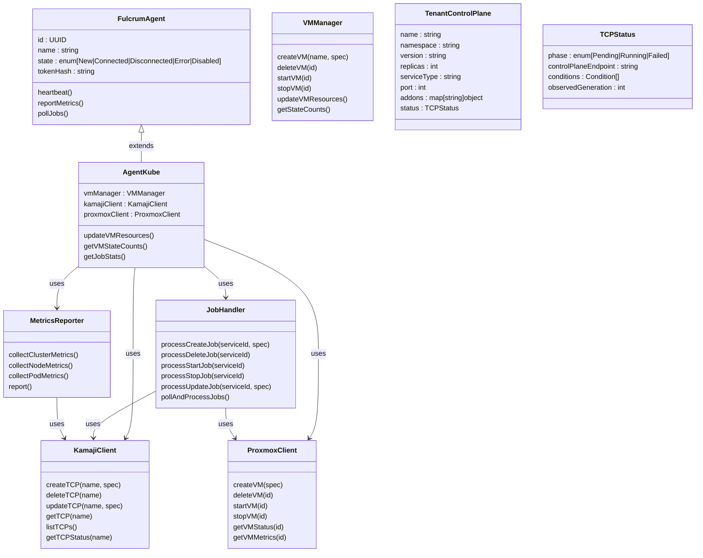
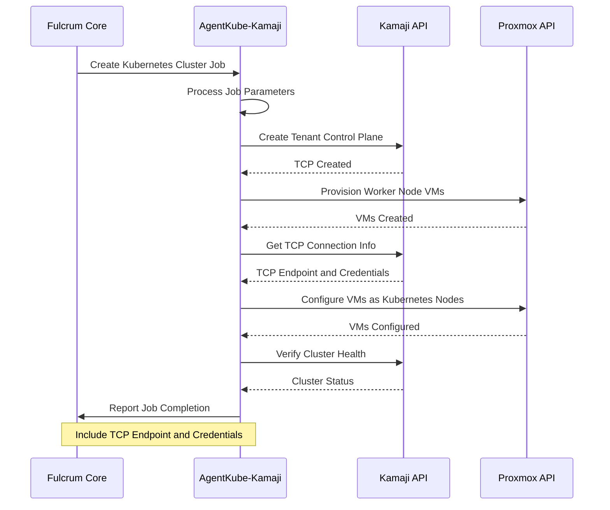
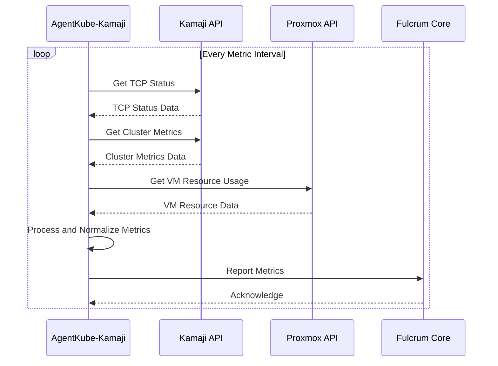

# AgentKube-Kamaji

## Introduction

AgentKube-Kamaji is a specialized agent within the Fulcrum Core ecosystem designed to manage Kubernetes tenant clusters through Kamaji. It serves as a bridge between Fulcrum Core's centralized management system and Kamaji's multi-tenant Kubernetes architecture, enabling seamless provisioning and lifecycle management of Kubernetes clusters.

The system enables organizations to:

- Deploy and manage multiple tenant Kubernetes clusters through a single control plane
- Automate the provisioning of Kubernetes resources across different environments
- Efficiently utilize infrastructure by sharing control plane components
- Monitor and collect metrics from tenant clusters
- Integrate with Proxmox for VM-based tenant cluster nodes
- Apply standardized configurations and security policies across tenant clusters
- Process jobs from Fulcrum Core's job queue system

## Context

AgentKube-Kamaji operates within the broader Fulcrum ecosystem, serving as a specialized agent that connects Fulcrum Core to Kamaji for Kubernetes cluster management. The following diagram illustrates how AgentKube-Kamaji interacts with other components in the system:

### Components and Their Roles

#### AgentKube-Kamaji

AgentKube-Kamaji is a Fulcrum agent specialized in managing Kubernetes clusters through Kamaji. It:

- Authenticates with Fulcrum Core and processes job requests
- Interacts with Kamaji API to create and manage Tenant Control Planes (TCPs)
- Provisions and manages VMs on Proxmox for tenant cluster nodes
- Collects and reports metrics from Kamaji and tenant clusters
- Handles the lifecycle of Kubernetes tenant clusters
- Processes service operations (create, update, delete) for Kubernetes resources
- Maintains secure communications with Fulcrum Core through token-based authentication
- Reports service status and operational data back to Fulcrum Core

#### Kamaji Parent Cluster

The Kamaji Parent Cluster is a Kubernetes cluster that hosts the control planes for tenant clusters. It:

- Provides the infrastructure for running tenant control planes
- Manages the etcd instances for each tenant cluster
- Efficiently shares resources across multiple tenant control planes
- Handles networking between tenant control planes and worker nodes
- Utilizes a LoadBalancer (MetalLB) to expose tenant control planes

#### Tenant Control Planes (TCPs)

Tenant Control Planes represent individual Kubernetes clusters managed by Kamaji. They:

- Contain the Kubernetes control plane components (API server, controller manager, scheduler)
- Expose an API endpoint for worker nodes to connect to
- Maintain isolation between different tenant clusters
- Allow custom configuration of Kubernetes versions and settings
- Support addons like CoreDNS, kube-proxy, and konnectivity

## Model

This section outlines the key entities in the AgentKube-Kamaji system and their relationships.

### Class Diagram

### Entities

#### Core Components

1. **AgentKube**
   - Extension of the base Fulcrum Agent specialized for Kubernetes management
   - Implements the Fulcrum agent interface for integration with Fulcrum Core
   - Contains specialized components for interacting with Kamaji and Proxmox
   - Manages the lifecycle of tenant Kubernetes clusters
   - Processes jobs from Fulcrum Core and translates them to Kamaji/Proxmox operations

2. **KamajiClient**
   - Handles interactions with the Kamaji API
   - Creates, updates, and deletes Tenant Control Planes (TCPs)
   - Monitors TCP status and health
   - Configures TCP specifications like Kubernetes version, replicas, and addons

3. **ProxmoxClient**
   - Manages interactions with Proxmox VE API
   - Provisions and manages virtual machines for Kubernetes nodes
   - Monitors VM status and resource utilization
   - Handles VM lifecycle operations (create, start, stop, delete)

4. **JobHandler**
   - Processes jobs from Fulcrum Core job queue
   - Translates Fulcrum service operations to Kamaji/Proxmox operations
   - Manages the job lifecycle from claiming to completion
   - Reports job status back to Fulcrum Core

5. **MetricsReporter**
   - Collects metrics from Kamaji parent cluster and tenant clusters
   - Gathers VM performance data from Proxmox
   - Reports resource utilization to Fulcrum Core
   - Monitors health of control planes and worker nodes

6. **VMManager**
   - Manages the lifecycle of VMs used for Kubernetes nodes
   - Tracks VM states and resource utilization
   - Coordinates with Proxmox for VM operations
   - Updates VM resources based on service requirements

#### Kamaji Resources

1. **TenantControlPlane (TCP)**
   - Represents a tenant Kubernetes cluster configuration
   - Defines control plane specifications like replicas and Kubernetes version
   - Configures networking, addons, and other cluster settings
   - Maps to Kubernetes custom resources in the Kamaji parent cluster

2. **TCPStatus**
   - Tracks the current state of a tenant control plane
   - Provides endpoint information for connecting to the tenant cluster
   - Contains conditions that reflect the health of the TCP
   - Used for monitoring and error detection

## Architecture

AgentKube-Kamaji is built with Go, leveraging its concurrency model and performance characteristics to efficiently manage Kubernetes clusters. The system integrates with both Fulcrum Core and Kamaji to provide comprehensive Kubernetes management.

### Architectural Layers

AgentKube-Kamaji follows a modular architecture organized into the following layers:

1. **Agent Core Layer**
   - Implements the Fulcrum agent interface
   - Handles authentication and communication with Fulcrum Core
   - Manages agent lifecycle and state
   - Coordinates operations between different components

2. **Job Processing Layer**
   - Polls and processes jobs from Fulcrum Core
   - Translates job actions to Kamaji and Proxmox operations
   - Manages the job lifecycle (claim, process, complete/fail)
   - Reports job status back to Fulcrum Core

3. **Kamaji Integration Layer**
   - Interacts with Kamaji API to manage tenant clusters
   - Creates and configures Tenant Control Planes
   - Monitors TCP status and health
   - Processes Kubernetes-specific operations

4. **VM Management Layer**
   - Interfaces with Proxmox API to manage virtual machines
   - Provisions and configures VMs for Kubernetes nodes
   - Monitors VM status and resource utilization
   - Handles VM lifecycle operations

5. **Metrics Collection Layer**
   - Gathers metrics from Kamaji, tenant clusters, and Proxmox
   - Processes and normalizes collected data
   - Reports metrics to Fulcrum Core
   - Monitors system health and performance

### Deployment Architecture

AgentKube-Kamaji is typically deployed alongside a Kamaji parent cluster, with access to both Fulcrum Core and Proxmox. The deployment architecture follows this pattern:

1. **Kamaji Parent Cluster**
   - High-availability Kubernetes cluster (typically 3+ nodes)
   - Hosts tenant control planes as deployments
   - Uses etcd for storing cluster state
   - Contains MetalLB for LoadBalancer services
   - Runs cert-manager for certificate management

2. **AgentKube-Kamaji**
   - Runs as a standalone service with access to the Kamaji API
   - Connects to Fulcrum Core for job processing and reporting
   - Interfaces with Proxmox for VM management
   - Maintains persistent connections for efficient operation

3. **Proxmox Cluster**
   - Provides virtualization infrastructure for Kubernetes nodes
   - Hosts VMs for tenant cluster worker nodes
   - Manages compute, storage, and network resources
   - Provides API for VM lifecycle management

### Workflow Diagrams

#### Tenant Cluster Creation Workflow

#### Tenant Cluster Monitoring

## Implementation Details

### Agent Integration with Fulcrum Core

AgentKube-Kamaji integrates with Fulcrum Core using the standard agent interface, which includes:

- Token-based authentication
- Status updates through heartbeat mechanism
- Job polling and processing
- Metrics reporting
- Service lifecycle management

### Kamaji Management

The agent manages Kamaji Tenant Control Planes through the Kubernetes API, using:

- Custom Resource Definitions (CRDs) for TCP management
- Kubernetes API server for resource creation and updates
- Watch mechanisms for monitoring TCP status changes
- Resource management for control plane components

### Proxmox VM Management

For managing virtual machines on Proxmox, the agent:

- Uses the Proxmox VE API for VM operations
- Manages VM templates for quick node provisioning
- Monitors VM resource utilization
- Handles VM lifecycle events

### Configuration and Customization

AgentKube-Kamaji supports various configuration options:

- TCP template customization
- Node resource allocation
- Kubernetes version selection
- Network configuration options
- Custom addons and extensions

## Conclusion

AgentKube-Kamaji extends Fulcrum Core's capabilities to manage Kubernetes clusters using Kamaji's multi-tenant architecture. By leveraging both Kamaji for Kubernetes management and Proxmox for infrastructure provisioning, it provides a comprehensive solution for deploying and managing Kubernetes at scale.

The integration with Fulcrum Core enables consistent management across different service types, while the specialized Kubernetes and VM management capabilities ensure efficient operation of tenant clusters. This combination makes AgentKube-Kamaji a powerful tool for organizations that need to provision and manage multiple Kubernetes environments through a unified interface.